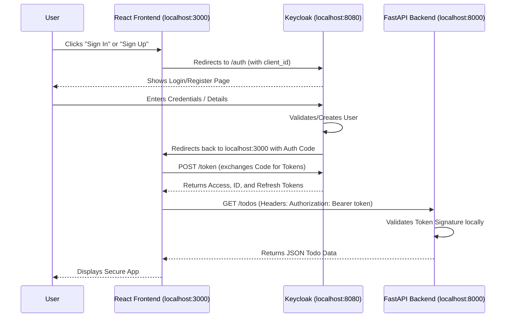

# Authentication Flow Details

This document explains exactly what happens under the hood when a user clicks the **Sign In** or **Create Account** (Sign Up) buttons in the React application.

Our application uses **OpenID Connect (OIDC)**, an identity layer built on top of the OAuth 2.0 protocol. The specific flow utilized here by the `keycloak-js` adapter is the **Authorization Code Flow** (the most secure and standard flow for Single Page Applications).

---

## 1. The Sign-In Flow

When a user clicks the **Sign In** button, the following sequence of events occurs:

### Step 1: Initialization & Redirect
*   **Action**: The user clicks `keycloak.login()`.
*   **Under the hood**: The `keycloak-js` library generates a secure random string called a `state` parameter (to prevent CSRF attacks) and redirects the browser window away from your React app to Keycloak's **Authorization Endpoint**.
*   **URL looks like**: `http://localhost:8080/realms/myrealm/protocol/openid-connect/auth?client_id=react-client&response_type=code&redirect_uri=http://localhost:3000/&state=...`

### Step 2: User Authentication
*   **Action**: Keycloak displays its built-in, secure Login page.
*   **Under the hood**: Keycloak prompts the user for their credentials (username/password). Because this happens on Keycloak's server, your React app **never sees the user's password**, which is a massive security benefit.

### Step 3: Authorization Code Delivery
*   **Action**: The user successfully logs in, and Keycloak redirects the browser back to your React app.
*   **Under the hood**: Keycloak sends the user back to the `redirect_uri` (which we configured as `http://localhost:3000/*` in our realm config). It appends a temporary, one-time-use **Authorization Code** to the URL.
*   **URL looks like**: `http://localhost:3000/?state=...&session_state=...&code=xyz123abc...`

### Step 4: Token Exchange
*   **Action**: The React app loads and immediately notices the `code` in the URL.
*   **Under the hood**: The `keycloak.init()` method (which runs when `App.jsx` mounts) catches this code. It immediately makes a secure, behind-the-scenes `POST` HTTP request to Keycloak's **Token Endpoint**, exchanging the temporary Authorization Code for the actual authentication tokens.
*   **Result**: Keycloak responds with three tokens:
    1.  **Access Token**: A short-lived JWT that proves who the user is and what they can access.
    2.  **ID Token**: Information about the user's profile (like their username, email, etc.).
    3.  **Refresh Token**: A long-lived token used to silently get a new Access Token when the old one expires.

### Step 5: Application State Update
*   **Action**: The user views the secure Todo list.
*   **Under the hood**: The `keycloak.init()` promise resolves beautifully returning `true`. Our React state sets `authenticated` to `true`. When making requests to the FastAPI backend, we intercept the request and inject the Access Token into the HTTP Headers (`Authorization: Bearer <access_token>`). The FastAPI backend verifies this token's signature, validates it, and serves the user's specific data.

---

## 2. The Sign-Up Flow

The Sign-Up flow is remarkably similar to the Sign-In flow, but with an intermediate registration step.

### Step 1: Initialization & Redirect
*   **Action**: The user clicks the **Create Account** button, triggering `keycloak.register()`.
*   **Under the hood**: The `keycloak-js` library redirects the user to the exact same Authorization Endpoint as before. However, it appends a specific query parameter (like `kc_action=register` or similar, depending on the Keycloak version) to tell Keycloak to skip the login form and immediately show the Registration form.

### Step 2: Account Creation
*   **Action**: Keycloak displays the Registration form.
*   **Under the hood**: The user fills in their details (First Name, Last Name, Email, Username, and Password). When they submit the form, Keycloak securely hashes their password and stores the new user record in its **PostgreSQL database**.

### Step 3: Automatic Login
*   **Action**: Keycloak registers the user.
*   **Under the hood**: Instead of making the user log in immediately after signing up, Keycloak intelligently logs them in right away. Keycloak proceeds directly to generating an **Authorization Code**, exactly as it does in Step 3 of the Sign-In Flow.

### Step 4 & 5: Token Exchange & Application State Update
*   **Action**: The user is redirected back to the React app and sees the secure Todo list.
*   **Under the hood**: The React app receives the `code`, exchanges it for tokens, and updates the application state. To the React application, there is absolutely no difference between a user logging in and a user just signing up. They arrive back with a valid token either way!

## Visual Summary

