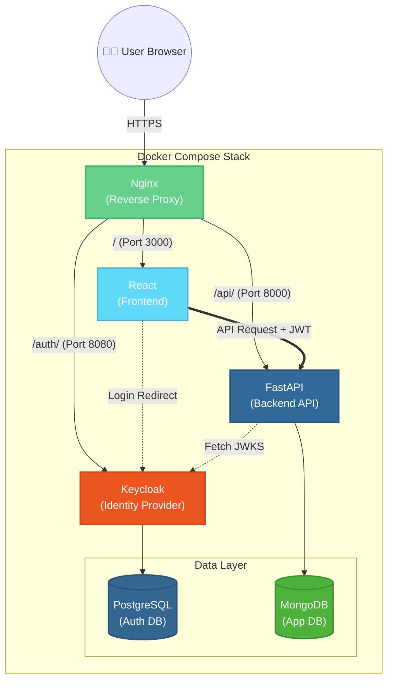

# Welcome to the User Auth Documentation

This comprehensive documentation site provides technical insights and explanations regarding the architecture and authentication flows of our modern web stack.

---

## 🏗️ Application Architecture

Our application is built using a decoupled, service-oriented architecture designed to demonstrate enterprise-grade authentication patterns.

### The Stack

*   **Reverse Proxy**: **Nginx**
    *   The single secure entrypoint (`https://localhost`) for the entire application.
    *   Generates self-signed SSL certificates and routes traffic to the appropriate internal services based on the URL path (`/`, `/api/`, `/auth/`).
*   **Frontend (Client)**: **React (Vite)**
    *   Acts as the public-facing user interface.
    *   Uses the `keycloak-js` adapter to manage session state and redirect users to the identity provider securely.
*   **Identity Provider (IdP)**: **Keycloak**
    *   The central, trusted authority for all user identity and access management.
    *   Handles user registrations, logins, secure sessions, and issues JSON Web Tokens (JWTs).
*   **Keycloak Database**: **PostgreSQL**
    *   A robust relational database dedicated entirely to Keycloak for storing realms, clients, users, and credentials.
*   **Backend API**: **FastAPI (Python)**
    *   A high-performance, asynchronous REST API.
    *   Acts as a "Resource Server." It does not manage passwords; instead, it expects a valid JWT in the HTTP `Authorization` header and cryptographically verifies it before serving data.
*   **Backend Database**: **MongoDB**
    *   A NoSQL document database used by FastAPI to store the actual application data (the user's individual Todo items).

### How They Interact

1. The **React Frontend** explicitly refuses to handle user passwords. Instead, it delegates authentication by redirecting the user to **Keycloak**.
2. **Keycloak** verifies the user against its **PostgreSQL** database and issues tokens back to the frontend.
3. The **React Frontend** attaches the Access Token to API requests and sends them to the **FastAPI Backend**.
4. The **FastAPI Backend** intercepts the request, validates the token physically against Keycloak's public keys, and then reads/writes the requested data from **MongoDB**.

---

## 📚 Learning Authentication Concepts

Authentication and identity management can be complex, but breaking it down into standardized protocols makes it manageable. Here is how you can use this documentation to learn:

1.  **Understand the Standards**: Start by reading the [**Authentication Protocols**](auth-types.md) guide. This explains the fundamental difference between Authorization (OAuth 2.0) and Authentication (OIDC/SAML).
2.  **Learn the Grant Types**: Once you understand the protocols, read about the [**OAuth Grant Types**](oauth-grants.md) to see the different ways applications securely acquire tokens based on their environment (Web vs Mobile vs Machine-to-Machine).
3.  **Trace the Actual Flow**: See these concepts in action by reading the [**Authentication Flow**](authentication-flow.md) document. This walks you step-by-step through our specific React application's OpenID Connect Authorization Code Flow, complete with a sequence diagram.
4.  **Understand Cryptographic Security**: Finally, read the [**Backend Token Verification**](backend-verification.md) page to learn how our FastAPI backend mathematically proves that the token provided by the user is genuine and untampered, without having to contact Keycloak's database directly on every request.
